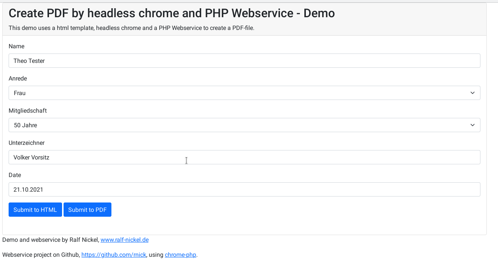
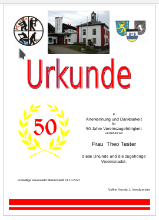

# KeyReport

KeyReport is a PHP-webservice creating PDFs by using headles chrome's save-to-pdf function. It was more a proof of concept, but we use it with a couple of applications in production. It is possible to convert any Webpage and using simple or more complex HTML-Pages as a template. 

The template is the webpage which is loaded by the webservice to convert to pdf. You can use the demo-template KeyReport-Demo-Template from https://github.com/rnick/KeyReport-Demo-Template as a test. So clone it to the webroot.

This project contains a demo template to test the main project https://github.com/rnick/KeyReport and contains a html-page and a webform that submits some parameters to the webservice, and finaly downloads the PDF.

The demo is a membership certificate of honor for supporting the local volunteer firefighters where you have to fill some form fields like name, membership, salutation and submit it to the html preview or convert it to PDF by the installed KeyReport webservice.

## Installation
```console
$ cd /var/www/html
$ git clone https://github.com/rnick/KeyReport-Demo-Template.git ./demotpl

$ cd demotpl
$ composer install
```

## Test
Navigate to the demo webform at http://localhost/demotpl/urkunde/demo.html to enter some parameter. Submit the Form to HTML-preview or to convert to PDF.





### BTW
Support you local Firefighters! :)